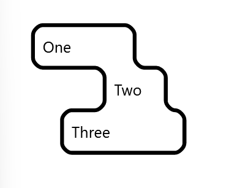
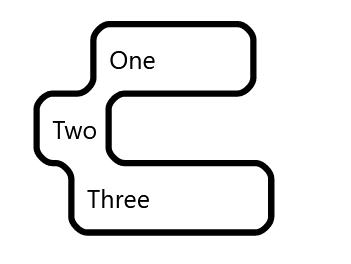

# Borderline

⚠️ **Early Testing Phase - Probably Broken** ⚠️

## A React component for drawing borders around groups of elements

Inverted corners are hard. Have you ever wanted to do this?



Good Luck! 😅

Until now... Check this out:



😎

## Installation

```bash
npm install borderline
```

## Usage

```jsx
import Borderline from 'borderline'

function App() {
	return (
		<>
			<Borderline>
				<div>One</div>
				<div>Two</div>
				<div>Three</div>
			</Borderline>
		</>
	)
}
```

## Props

| Prop                   | Type    | Default       | Description                                                                                     |
| ---------------------- | ------- | ------------- | ----------------------------------------------------------------------------------------------- |
| pathRadius             | number  | 2             | The radius of the borderline                                                                    |
| pathStroke             | string  | "black"       | The color of the borderline                                                                     |
| pathFill               | string  | "transparent" | The color of the fill of the borderline shape                                                   |
| cornerRadius           | number  | 20            | The radius of the corners of the elements                                                       |
| controlRatio           | number  | 0.551915      | The ratio of the control points for the bezier curves. The default point approximates a circle. |
| sharpTopLeftCorner     | boolean | false         | Make the top left corner sharp                                                                  |
| sharpTopRightCorner    | boolean | false         | Make the top right corner sharp                                                                 |
| sharpBottomLeftCorner  | boolean | false         | Make the bottom left corner sharp                                                               |
| sharpBottomRightCorner | boolean | false         | Make the bottom right corner sharp                                                              |

## Development Props

| Prop            | Type    | Default | Description                                    |
| --------------- | ------- | ------- | ---------------------------------------------- |
| skipSmallLedges | boolean | false   | Skip small ledges when traversing the elements |
| roundedPoints   | boolean | true    | Round the points to the nearest integer        |

## How it works

The algorithm is pretty simple, it is the same one that those toy robot line-followers use:

1. Find all the elements that are direct children of the Borderline component
1. For each bounding box, create vectors between the corners in a clockwise direction
1. Start at the top left corner and begin following the vectors
1. At each endpoint, try to turn left, continue straight, or turn right, in that order.
1. Continue until you reach the starting point.
1. Calculate the midpoints, anchor points, and control points for the SVG path.
1. Draw the path. Done!

There are some finer details, like how to avoid hopping over nontraversable gaps and such, but that's basically it.

Another approach would be a hull algorithm, but they do not handle concavity well and do not take advantage of the fact that we know the elements are rectangles.

## Caveats

- The elements must be rectangles
- The only elements that are counted ane the direct children of the Borderline component
- The elements must not overlap
- There is some lag, because it needs to wait for the elements to render before calculating the path
- The algorithm is not optimized and could be faster. If I use it enough, I might have to rewrite it.
- It generally kinda seems like overkill to create a traversal vectorspace and fire a whole pathfinding algorithm every frame that changes. Such is the price of beauty, I suppose.

TODO:

- [ ] Smooth out skipping small ledges
- [ ] Break apart the algorithm into smaller functions
- [ ] Optimize the algorithm
- [ ] Fix corners to use the path corners instead of the element corners
- [ ] Add tests
- [ ] Add examples
- [ ] Support overlapping divs
- [ ] Support multiple borders for disconnected groups within the same element
- [ ] TailwindCSS plugin component
- [ ] Add support for different border styles
- [ ] Figure out why the package is so big
